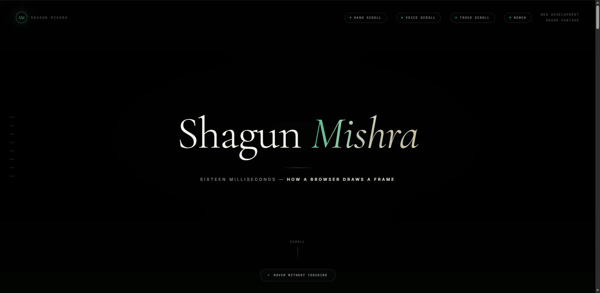

# Sixteen Milliseconds



A guided tour of the browser rendering pipeline — script, style, layout, paint and
composite — with every stage running live on the page. One HTML file, no build step:
shaders as template strings, a fluid solver, map geometry and an audio graph, all
viewable with "view source."

## Pages

- `index.html` — the main tour: hero, layout thrashing demo, GPU fluid composite
  (with live solver-parameter sliders), text/glyph shaping, and a theme customiser
- `hand-scroll.html`, `voice-scroll.html`, `touch-scroll.html` — alternate scroll
  interactions (webcam hand tracking, voice commands, touch gestures)
- `bench.html` — a rendering-pipeline benchmark page

## Run

Serve the folder statically and open `index.html`, e.g.:

```
python -m http.server 5300
```
